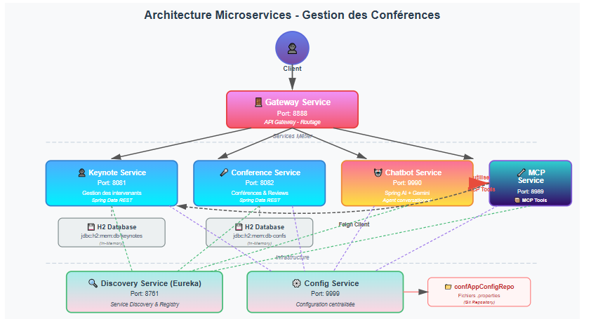
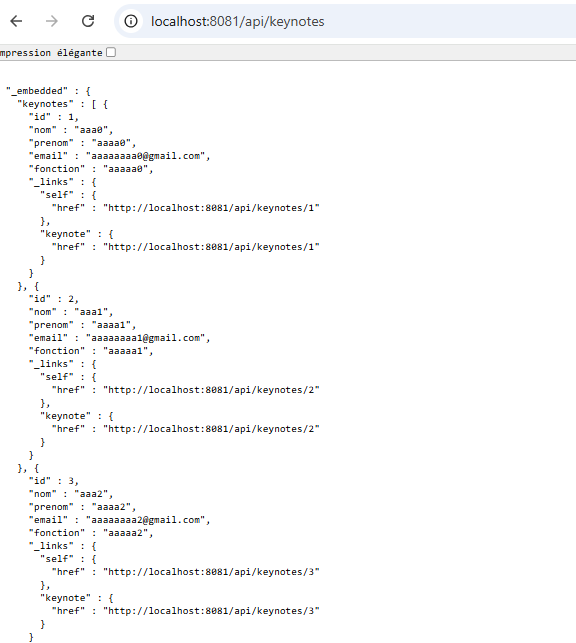
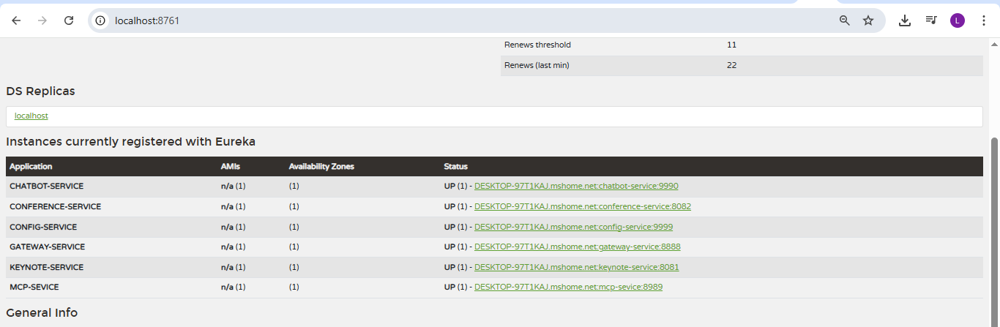

# 🎤 Système de Gestion des Conférences

## 📋 Table des matières

- [Vue d'ensemble](#-vue-densemble)
- [Architecture](#-architecture)
- [Technologies utilisées](#-technologies-utilisées)
- [Prérequis](#-prérequis)
- [Installation](#-installation)
- [Configuration](#-configuration)
- [Démarrage des services](#-démarrage-des-services)
- [Documentation des API](#-documentation-des-api)
- [Exemples d'utilisation](#-exemples-dutilisation)
- [Tests et vérifications](#-tests-et-vérifications)
- [Structure du projet](#-structure-du-projet)
- [Dépannage](#-dépannage)


---

## 🎯 Vue d'ensemble

Ce projet est une **application de gestion de conférences** basée sur une architecture microservices moderne avec Spring Boot. Le système permet de gérer des conférences, des intervenants (keynotes), des avis (reviews) et intègre un chatbot intelligent alimenté par l'IA.

### Fonctionnalités principales

- ✅ Gestion complète des conférences (CRUD)
- 👤 Gestion des intervenants (keynotes)
- ⭐ Système d'évaluation et d'avis
- 🤖 Chatbot intelligent avec Spring AI (Google Gemini)
- 🔍 Service Discovery avec Eureka
- ⚙️ Configuration centralisée
- 🚪 API Gateway pour le routage
- 🔧 Intégration MCP (Model Context Protocol)

---

## 🏗️ Architecture

### Diagramme architectural



### Services et ports

| Service | Port | Description | Base de données |
|---------|------|-------------|-----------------|
| **Discovery Service** | 8761 | Eureka Server pour la découverte de services | - |
| **Config Service** | 9999 | Serveur de configuration centralisée | - |
| **Keynote Service** | 8081 | Gestion des intervenants | H2 (mem:db-keynotes) |
| **Conference Service** | 8082 | Gestion des conférences et reviews | H2 (mem:db-confs) |
| **MCP Service** | 8989 | Serveur MCP pour l'intégration IA | - |
| **Chatbot Service** | 9990 | Service de chatbot intelligent (Google Gemini) | - |
| **Gateway Service** | 8888 | Point d'entrée unique (API Gateway) | - |

---

## 🛠️ Technologies utilisées

### Backend & Framework
- **Java 21+** - Langage principal
- **Spring Boot 3.x** - Framework applicatif
- **Spring Cloud** - Microservices patterns
    - Spring Cloud Netflix Eureka (Service Discovery)
    - Spring Cloud Config (Configuration centralisée)
    - Spring Cloud Gateway (API Gateway)
    - Spring Cloud OpenFeign (Communication inter-services)

### Bases de données
- **H2 Database** - Base de données en mémoire pour le développement
- **Spring Data JPA** - Couche de persistance
- **Spring Data REST** - Exposition automatique des repositories

### Intelligence Artificielle
- **Spring AI** - Framework d'intégration IA
- **Google Gemini API** - Modèle de langage pour le chatbot
- **MCP (Model Context Protocol)** - Protocole d'intégration des modèles

### Outils de développement
- **Maven** - Gestion des dépendances et build
- **Lombok** - Réduction du code boilerplate
- **PowerShell** - Scripts de démarrage

---

## ✅ Prérequis

Avant de commencer, assurez-vous d'avoir installé :

### Obligatoire
- ☑️ **Java Development Kit (JDK) 21 ou supérieur**
  ```bash
  java -version
  # Devrait afficher : java version "21.x.x" ou supérieur
  ```

- ☑️ **Maven 3.8+** (ou utilisez le wrapper Maven fourni)
  ```bash
  mvn -version
  ```

- ☑️ **Connexion Internet** (pour télécharger les dépendances et accéder au Config Server)

### Recommandé
- ☑️ **PowerShell** (Windows) ou **Bash** (Linux/Mac)
- ☑️ **Git** (pour cloner le repository de configuration)
- ☑️ **Postman** ou **cURL** (pour tester les API)
- ☑️ **IDE** : IntelliJ IDEA, Eclipse, ou VS Code

### Clés API
- ☑️ **Google Gemini API Key** (pour le chatbot-service)
    - Obtenez votre clé sur : https://ai.google.dev/

---

## 📥 Installation

### 1. Cloner le projet

```bash
git clone <URL_DU_REPO>
cd gestionDesConference
```

### 2. Vérifier la structure

```
gestionDesConference/
├── chatbot-service/
├── confAppConfigRepo/
├── conference-service/
├── config-service/
├── discovery-service/
├── gateway-service/
├── keynote-service/
├── mcp-service/
├── src/
├── pom.xml
└── README.md
```

### 3. Compiler le projet

```bash
# Depuis la racine du projet
mvn clean install -DskipTests
```

---

## ⚙️ Configuration

### Configuration centralisée

Le projet utilise **Spring Cloud Config Server** qui pointe vers le dossier `confAppConfigRepo`. Les fichiers de configuration sont :

- `application.properties` - Configuration globale
- `keynote-service.properties` - Configuration du service keynote
- `conference-service.properties` - Configuration du service conference
- `gateway-service.properties` - Configuration du gateway
- etc.

### Configuration du Chatbot

**Important** : Le chatbot-service nécessite une clé API Google Gemini.

#### Option 1 : Variable d'environnement (recommandée)

```powershell
# PowerShell (Windows)
$env:SPRING_AI_GOOGLE_GENAI_API_KEY = "VOTRE_CLE_API_ICI"

# Bash (Linux/Mac)
export SPRING_AI_GOOGLE_GENAI_API_KEY="VOTRE_CLE_API_ICI"
```

#### Option 2 : Fichier application.properties

**⚠️ Non recommandé pour la production**

```properties
# chatbot-service/src/main/resources/application.properties
spring.ai.google.genai.api-key=VOTRE_CLE_API_ICI
```

#### Option 3 : Argument en ligne de commande

```powershell
.\mvnw.cmd spring-boot:run -Dspring-boot.run.arguments="--spring.ai.google.genai.api-key=VOTRE_CLE_API_ICI"
```

---

## 🚀 Démarrage des services

### Ordre de démarrage (IMPORTANT)

Les services doivent être démarrés dans cet ordre pour assurer le bon fonctionnement :

1. **Discovery Service** (Eureka) - Port 8761
2. **Config Service** - Port 9999
3. **Services métier** (dans n'importe quel ordre)
    - Keynote Service - Port 8081
    - Conference Service - Port 8082
    - MCP Service - Port 8989
    - Chatbot Service - Port 9990
4. **Gateway Service** - Port 8888

> **Pourquoi cet ordre ?** Eureka et Config Server doivent être disponibles en premier pour que les autres services puissent s'enregistrer et récupérer leurs configurations.

### Méthode 1 : Démarrage depuis le dossier de chaque service

Ouvrez **7 fenêtres PowerShell** (une par service) :

#### 1️⃣ Discovery Service
```powershell
cd discovery-service
.\mvnw.cmd spring-boot:run
```
✅ Attendez que le message "Started DiscoveryServiceApplication" apparaisse

#### 2️⃣ Config Service
```powershell
cd config-service
.\mvnw.cmd spring-boot:run
```
✅ Attendez le démarrage complet

#### 3️⃣ Keynote Service
```powershell
cd keynote-service
.\mvnw.cmd spring-boot:run
```

#### 4️⃣ Conference Service
```powershell
cd conference-service
.\mvnw.cmd spring-boot:run
```

#### 5️⃣ MCP Service
```powershell
cd mcp-service
.\mvnw.cmd spring-boot:run
```

#### 6️⃣ Chatbot Service
```powershell
cd chatbot-service
$env:SPRING_AI_GOOGLE_GENAI_API_KEY = "VOTRE_CLE_API_ICI"
.\mvnw.cmd spring-boot:run
```

#### 7️⃣ Gateway Service
```powershell
cd gateway-service
.\mvnw.cmd spring-boot:run
```

### Méthode 2 : Démarrage depuis la racine du projet

```powershell
# Depuis la racine, cibler un module spécifique
.\mvnw.cmd -pl discovery-service spring-boot:run
.\mvnw.cmd -pl config-service spring-boot:run
.\mvnw.cmd -pl keynote-service spring-boot:run
.\mvnw.cmd -pl conference-service spring-boot:run
.\mvnw.cmd -pl mcp-service spring-boot:run
.\mvnw.cmd -pl chatbot-service spring-boot:run
.\mvnw.cmd -pl gateway-service spring-boot:run
```

### Vérification du démarrage

Une fois tous les services démarrés, vérifiez :

1. **Eureka Dashboard** : http://localhost:8761/
    - Vous devriez voir tous les services enregistrés

2. **Logs de chaque service** :
    - Recherchez : `"Started [ServiceName]Application in X seconds"`

---

## 📚 Documentation des API

### 🔍 Discovery Service (Eureka)

**URL** : http://localhost:8761/

- Interface web pour visualiser tous les services enregistrés
- Aucune API REST publique

### ⚙️ Config Service

**URL de base** : http://localhost:9999/

**Endpoints** :
```
GET /{application}/{profile}
GET /{application}/{profile}/{label}
```

**Exemple** :
```bash
curl http://localhost:9999/keynote-service/default
```

### 👤 Keynote Service

**URL de base** : http://localhost:8081/api/keynotes

**Base de données** : H2 in-memory (jdbc:h2:mem:db-keynotes)

#### Modèle de données : Keynote

```java
{
  "id": Long,
  "nom": String,
  "prenom": String,
  "email": String,
  "fonction": String
}
```

#### Endpoints

| Méthode | Endpoint | Description |
|---------|----------|-------------|
| GET | `/api/keynotes` | Liste tous les keynotes |
| GET | `/api/keynotes/{id}` | Récupère un keynote par ID |
| POST | `/api/keynotes` | Crée un nouveau keynote |
| PUT | `/api/keynotes/{id}` | Met à jour un keynote |
| DELETE | `/api/keynotes/{id}` | Supprime un keynote |
| GET | `/api/keynotes/search` | Recherche avancée (Spring Data REST) |

#### Exemples

**GET - Liste des keynotes**
```bash
curl http://localhost:8081/api/keynotes
```


**GET - Keynote par ID**
```bash
curl http://localhost:8081/api/keynotes/1
```

**POST - Créer un keynote**
```bash
curl -X POST http://localhost:8081/api/keynotes \
  -H "Content-Type: application/json" \
  -d '{
    "nom": "Dupont",
    "prenom": "Alice",
    "email": "alice.dupont@example.com",
    "fonction": "Ingénieure Data"
  }'
```

**PUT - Mettre à jour un keynote**
```bash
curl -X PUT http://localhost:8081/api/keynotes/1 \
  -H "Content-Type: application/json" \
  -d '{
    "nom": "Dupont",
    "prenom": "Alice",
    "email": "alice.dupont@example.com",
    "fonction": "Senior Data Engineer"
  }'
```

**DELETE - Supprimer un keynote**
```bash
curl -X DELETE http://localhost:8081/api/keynotes/1
```

### 🎤 Conference Service

**URL de base** : http://localhost:8082/api/conferences

**Base de données** : H2 in-memory (jdbc:h2:mem:db-confs)

#### Modèle de données : Conference

```java
{
  "id": Long,
  "titre": String,
  "confType": "TECHNIQUE" | "BUSINESS" | "WORKSHOP",
  "durée": Integer,              // en minutes
  "nbreInscrits": Integer,
  "score": Integer,
  "creationDate": LocalDateTime,
  "keynoteId": Long,             // ID du keynote associé
  "keynote": Keynote,            // Objet keynote (transient)
  "reviews": [Review]            // Liste des avis
}
```

#### Modèle de données : Review

```java
{
  "id": Long,
  "date": LocalDateTime,
  "texte": String,
  "note": Double,                // Note entre 0 et 5
  "conf": Conference             // Référence à la conférence
}
```

#### Endpoints

**Conférences**

| Méthode | Endpoint | Description |
|---------|----------|-------------|
| GET | `/api/conferences` | Liste toutes les conférences |
| GET | `/api/conferences/{id}` | Récupère une conférence par ID |
| POST | `/api/conferences` | Crée une nouvelle conférence |
| PUT | `/api/conferences/{id}` | Met à jour une conférence |
| DELETE | `/api/conferences/{id}` | Supprime une conférence |

**Reviews**

| Méthode | Endpoint | Description |
|---------|----------|-------------|
| GET | `/api/reviews` | Liste tous les avis |
| GET | `/api/reviews/{id}` | Récupère un avis par ID |
| POST | `/api/reviews` | Crée un nouvel avis |
| PUT | `/api/reviews/{id}` | Met à jour un avis |
| DELETE | `/api/reviews/{id}` | Supprime un avis |

#### Exemples

**GET - Liste des conférences**
```bash
curl http://localhost:8082/api/conferences
```

**POST - Créer une conférence**
```bash
curl -X POST http://localhost:8082/api/conferences \
  -H "Content-Type: application/json" \
  -d '{
    "titre": "Microservices avec Spring Cloud",
    "confType": "TECHNIQUE",
    "durée": 90,
    "nbreInscrits": 50,
    "score": 0,
    "creationDate": "2025-12-31T10:00:00",
    "keynoteId": 1
  }'
```

**POST - Ajouter un avis**
```bash
curl -X POST http://localhost:8082/api/reviews \
  -H "Content-Type: application/json" \
  -d '{
    "date": "2025-12-31T14:30:00",
    "texte": "Excellente présentation, très claire et instructive !",
    "note": 4.5,
    "conf": "http://localhost:8082/api/conferences/1"
  }'
```

### 🤖 Chatbot Service

**URL de base** : http://localhost:9990/

**Technologie** : Spring AI + Google Gemini

#### Endpoint

```
GET /chat?query={votre_question}
```

**Description** : Envoie une question au chatbot et reçoit une réponse en streaming.

**Paramètres** :
- `query` (String, requis) : La question à poser au chatbot

**Type de réponse** : `text/plain` (streaming)

#### Exemples

```bash
# Question simple
curl "http://localhost:9990/chat?query=Bonjour"

# Question complexe
curl "http://localhost:9990/chat?query=Explique-moi%20les%20microservices"

# Interrogation sur les données du système
curl "http://localhost:9990/chat?query=Quelles%20sont%20les%20conférences%20disponibles?"
```

**PowerShell** :
```powershell
Invoke-WebRequest -Uri "http://localhost:9990/chat?query=Bonjour" | Select-Object -ExpandProperty Content
```

### 🔧 MCP Service

**URL de base** : http://localhost:8989/

**Description** : Service d'intégration MCP (Model Context Protocol) qui fournit des outils pour l'IA.

#### Fonctionnalités

- **getAllKeynotes** : Récupère tous les keynotes via Feign Client
- Intégration avec le chatbot via le protocole MCP

#### Exemple d'utilisation (interne)

Le MCP Service est principalement utilisé par le Chatbot Service pour enrichir ses réponses avec des données réelles du système.

### 🚪 Gateway Service

**URL de base** : http://localhost:8888/

**Description** : Point d'entrée unique pour accéder à tous les microservices.

#### Routage

| Route | Cible | Exemple |
|-------|-------|---------|
| `/keynote-service/**` | Keynote Service | `http://localhost:8888/keynote-service/api/keynotes` |
| `/conference-service/**` | Conference Service | `http://localhost:8888/conference-service/api/conferences` |
| `/chatbot-service/**` | Chatbot Service | `http://localhost:8888/chatbot-service/chat?query=test` |
| `/mcp-service/**` | MCP Service | `http://localhost:8888/mcp-service/mcp` |

#### Exemples via Gateway

```bash
# Keynotes via Gateway
curl http://localhost:8888/keynote-service/api/keynotes

# Conférences via Gateway
curl http://localhost:8888/conference-service/api/conferences

# Chatbot via Gateway
curl "http://localhost:8888/chatbot-service/chat?query=Bonjour"
```

---

## 💡 Exemples d'utilisation

### Scénario complet : Créer une conférence

#### 1. Créer un keynote

```bash
curl -X POST http://localhost:8081/api/keynotes \
  -H "Content-Type: application/json" \
  -d '{
    "nom": "Martin",
    "prenom": "Sophie",
    "email": "sophie.martin@tech.com",
    "fonction": "Tech Lead"
  }'
```

**Réponse** :
```json
{
  "id": 1,
  "nom": "Martin",
  "prenom": "Sophie",
  "email": "sophie.martin@tech.com",
  "fonction": "Tech Lead"
}
```

#### 2. Créer une conférence

```bash
curl -X POST http://localhost:8082/api/conferences \
  -H "Content-Type: application/json" \
  -d '{
    "titre": "Architecture Microservices : Retour d'expérience",
    "confType": "TECHNIQUE",
    "durée": 120,
    "nbreInscrits": 0,
    "score": 0,
    "creationDate": "2025-12-31T14:00:00",
    "keynoteId": 1
  }'
```

#### 3. Ajouter des avis

```bash
curl -X POST http://localhost:8082/api/reviews \
  -H "Content-Type: application/json" \
  -d '{
    "date": "2025-12-31T16:00:00",
    "texte": "Présentation excellente avec de nombreux exemples concrets",
    "note": 5.0,
    "conf": "http://localhost:8082/api/conferences/1"
  }'
```

#### 4. Interroger le chatbot

```bash
curl "http://localhost:9990/chat?query=Donne-moi%20des%20informations%20sur%20les%20conférences%20disponibles"
```

### Utilisation avec PowerShell

```powershell
# Variables
$keynoteUrl = "http://localhost:8081/api/keynotes"
$confUrl = "http://localhost:8082/api/conferences"

# Créer un keynote
$keynoteBody = @{
    nom = "Durand"
    prenom = "Pierre"
    email = "pierre.durand@example.com"
    fonction = "Architecte Cloud"
} | ConvertTo-Json

$keynote = Invoke-RestMethod -Uri $keynoteUrl -Method Post -Body $keynoteBody -ContentType "application/json"

# Créer une conférence
$confBody = @{
    titre = "Kubernetes en production"
    confType = "TECHNIQUE"
    durée = 90
    nbreInscrits = 0
    score = 0
    creationDate = "2025-12-31T10:00:00"
    keynoteId = $keynote.id
} | ConvertTo-Json

Invoke-RestMethod -Uri $confUrl -Method Post -Body $confBody -ContentType "application/json"
```

---

## 🧪 Tests et vérifications

### Vérification des services

#### 1. Dashboard Eureka
Ouvrez http://localhost:8761/ dans votre navigateur.

**Vérifications** :
- ✅ Tous les services sont listés dans "Instances currently registered with Eureka"
- ✅ Status est "UP" pour chaque service
- ✅ Aucun service ne montre le status "DOWN"

#### 2. Console H2 (bases de données)

**Keynote Service** :
- URL : http://localhost:8081/h2-console
- JDBC URL : `jdbc:h2:mem:db-keynotes`
- Username : `sa`
- Password : *(laisser vide)*

**Conference Service** :
- URL : http://localhost:8082/h2-console
- JDBC URL : `jdbc:h2:mem:db-confs`
- Username : `sa`
- Password : *(laisser vide)*

#### 3. Tests des endpoints

**Script de test complet (PowerShell)** :

```powershell
# Test Discovery
Write-Host "Testing Discovery Service..." -ForegroundColor Cyan
Invoke-WebRequest -Uri "http://localhost:8761/" -UseBasicParsing | Select-Object StatusCode

# Test Config Server
Write-Host "Testing Config Service..." -ForegroundColor Cyan
Invoke-WebRequest -Uri "http://localhost:9999/keynote-service/default" -UseBasicParsing | Select-Object StatusCode

# Test Keynote Service
Write-Host "Testing Keynote Service..." -ForegroundColor Cyan
Invoke-RestMethod -Uri "http://localhost:8081/api/keynotes" | ConvertTo-Json

# Test Conference Service
Write-Host "Testing Conference Service..." -ForegroundColor Cyan
Invoke-RestMethod -Uri "http://localhost:8082/api/conferences" | ConvertTo-Json

# Test Chatbot
Write-Host "Testing Chatbot Service..." -ForegroundColor Cyan
Invoke-WebRequest -Uri "http://localhost:9990/chat?query=test" -UseBasicParsing | Select-Object -ExpandProperty Content

# Test Gateway
Write-Host "Testing Gateway Service..." -ForegroundColor Cyan
Invoke-RestMethod -Uri "http://localhost:8888/keynote-service/api/keynotes" | ConvertTo-Json

Write-Host "`nAll tests completed!" -ForegroundColor Green
```

### Tests de charge et performance

Pour tester la résilience du système :

```bash
# Tester avec Apache Bench (si installé)
ab -n 1000 -c 10 http://localhost:8081/api/keynotes

# Tester avec cURL en boucle
for i in {1..100}; do
  curl http://localhost:8081/api/keynotes
done
```

---

## 📂 Structure du projet

```
gestionDesConference/
│
├── 📁 discovery-service/          # Service de découverte Eureka
│   ├── src/
│   │   └── main/
│   │       ├── java/
│   │       └── resources/
│   │           └── application.properties
│   └── pom.xml
│
├── 📁 config-service/             # Serveur de configuration
│   ├── src/
│   └── pom.xml
│
├── 📁 confAppConfigRepo/          # Repository de configurations
│   ├── application.properties
│   ├── keynote-service.properties
│   ├── conference-service.properties
│   └── gateway-service.properties
│
├── 📁 keynote-service/            # Service des intervenants
│   ├── src/
│   │   └── main/
│   │       ├── java/
│   │       │   └── com/example/keynote/
│   │       │       ├── entities/
│   │       │       │   └── Keynote.java
│   │       │       ├── repositories/
│   │       │       │   └── KeynoteRepository.java
│   │       │       └── KeynoteServiceApplication.java
│   │       └── resources/
│   │           └── application.properties
│   └── pom.xml
│
├── 📁 conference-service/         # Service des conférences
│   ├── src/
│   │   └── main/
│   │       ├── java/
│   │       │   └── com/example/conference/
│   │       │       ├── entities/
│   │       │       │   ├── Conference.java
│   │       │       │   └── Review.java
│   │       │       ├── repositories/
│   │       │       │   ├── ConfRepo.java
│   │       │       │   └── ReviewRepo.java
│   │       │       ├── clients/
│   │       │       │   └── KeynoteRestClient.java
│   │       │       └── ConferenceServiceApplication.java
│   │       └── resources/
│   └── pom.xml
│
├── 📁 chatbot-service/            # Service chatbot IA
│   ├── src/
│   │   └── main/
│   │       ├── java/
│   │       │   └── com/example/chatbot/
│   │       │       ├── controllers/
│   │       │       │   └── ChatController.java
│   │       │       ├── services/
│   │       │       │   └── AIAgent.java
│   │       │       └── ChatbotServiceApplication.java
│   │       └── resources/
│   └── pom.xml
│
├── 📁 mcp-service/                # Service MCP
│   ├── src/
│   │   └── main/
│   │       ├── java/
│   │       │   └── com/example/mcp/
│   │       │       ├── tools/
│   │       │       │   └── McpTools.java
│   │       │       ├── clients/
│   │       │       │   └── KeynoteRestClient.java
│   │       │       └── McpServiceApplication.java
│   │       └── resources/
│   └── pom.xml
│
├── 📁 gateway-service/            # API Gateway
│   ├── src/
│   └── pom.xml
│
├── 📄 pom.xml                     # POM parent
├── 📄 README.md                   # Ce fichier
└── 📄 .gitignore
```

---

## 🔧 Dépannage

### Problème : Service ne démarre pas

**Symptômes** :
- Erreur "Address already in use"
- Le service crash au démarrage

**Solutions** :
1. Vérifiez qu'aucun autre processus n'utilise le port :
   ```powershell
   # Windows
   netstat -ano | findstr :8081
   
   # Tuer le processus (remplacer PID)
   taskkill /PID <PID> /F
   ```

2. Changez le port dans `application.properties` :
   ```properties
   server.port=8091
   ```

### Problème : Service ne s'enregistre pas dans Eureka

**Symptômes** :
- Le service démarre mais n'apparaît pas dans Eureka Dashboard
- Logs : "Cannot execute request on any known server"

**Solutions** :
1. Vérifiez qu'Eureka est démarré et accessible : http://localhost:8761/
2. Vérifiez la configuration dans `application.properties` :
   ```properties
   eureka.client.service-url.defaultZone=http://localhost:8761/eureka
   eureka.client.register-with-eureka=true
   eureka.client.fetch-registry=true
   ```
3. Attendez 30 secondes (délai de heartbeat Eureka)

### Problème : Config Server ne trouve pas les configurations

**Symptômes** :
- Erreur 404 lors de l'accès aux configs
- Services ne démarrent pas avec message "Could not resolve placeholder"

**Solutions** :
1. Vérifiez le chemin du repository de config dans `config-service/application.properties` :
   ```properties
   spring.cloud.config.server.git.uri=file:///${user.home}/gestionDesConference/confAppConfigRepo
   # OU
   spring.cloud.config.server.native.search-locations=classpath:/config
   ```

2. Testez manuellement :
   ```bash
   curl http://localhost:9999/keynote-service/default
   ```

### Problème : Chatbot retourne une erreur 401/403

**Symptômes** :
- "API key not valid"
- "Authentication failed"

**Solutions** :
1. Vérifiez que la variable d'environnement est définie :
   ```powershell
   echo $env:SPRING_AI_GOOGLE_GENAI_API_KEY
   ```

2. Régénérez votre clé API sur https://ai.google.dev/

3. Redémarrez le service après avoir défini la clé

### Problème : Communication inter-services échoue

**Symptômes** :
- Feign Client retourne 404
- "Load balancer does not contain an instance"

**Solutions** :
1. Vérifiez que tous les services sont enregistrés dans Eureka
2. Vérifiez les noms des services dans `@FeignClient` :
   ```java
   @FeignClient(name = "keynote-service") // Doit correspondre au nom dans Eureka
   ```
3. Activez les logs Feign pour debug :
   ```properties
   logging.level.com.example=DEBUG
   ```

### Problème : Gateway ne route pas correctement

**Symptômes** :
- 404 lors de l'accès via Gateway
- Timeout errors

**Solutions** :
1. Vérifiez la configuration des routes dans `gateway-service/application.properties`
2. Testez l'accès direct au service (sans Gateway)
3. Vérifiez les logs du Gateway pour voir les routes chargées

### Problème : Base de données H2 vide

**Symptômes** :
- Aucune donnée dans H2 Console
- Tables non créées

**Solutions** :
1. Vérifiez l'activation de JPA :
   ```properties
   spring.jpa.hibernate.ddl-auto=update
   spring.h2.console.enabled=true
   ```

2. Ajoutez des données initiales dans `data.sql` :
   ```sql
   INSERT INTO keynote (nom, prenom, email, fonction) 
   VALUES ('Dupont', 'Alice', 'alice@example.com', 'Dev');
   ```

Note : Ce projet est à but éducatif 

